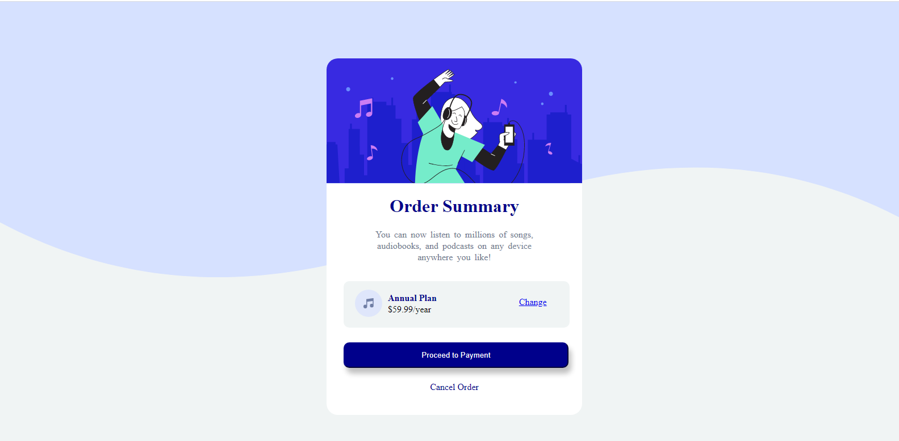

# Frontend Mentor - Order summary card solution

This is a solution to the [Order summary card challenge on Frontend Mentor](https://www.frontendmentor.io/challenges/order-summary-component-QlPmajDUj). Frontend Mentor challenges help you improve your coding skills by building realistic projects. 

## Table of contents

- [Overview](#overview)
  - [The challenge](#the-challenge)
  - [Screenshot](#screenshot)
  - [Links](#links)
- [My process](#my-process)
  - [Built with](#built-with)
  - [What I learned](#what-i-learned)
  - [Continued development](#continued-development)
  - [Useful resources](#useful-resources)
- [Author](#author)
- [Acknowledgments](#acknowledgments)


## Overview
- the project had to do with coming up with your own solution to creating a an order summary card.

### The challenge

Users should be able to:

- See hover states for interactive elements

### Screenshot



### Links

- Solution URL: [Add solution URL here](https://github.com/Rukkylaw/frontendmentor/tree/master)
- Live Site URL: [Add live site URL here](https://rukkylaw.github.io/frontendmentor/)

## My process
- I started by first creating the html document and classes, after which I style the document to look like I wanted.

### Built with

- Semantic HTML5 markup
- CSS custom properties
- Flexbox
- Mobile-first workflow

### What I learned
I learnt how to easily style a card and position it as desired using css flex property

```html
<div class="container"> the main card goes here</div>
```
```css
.container {
  display: flex;
  flex-direction: column;
  flex-wrap:wrap;
}
```
```js
const proudOfThisFunc = () => {
  console.log('🎉')
}
```

### Continued development
- I would like to known more about card designs and order cool css design that can make our work standout.
  and also when posting or releasing git you have to go to setting in the particuler repository, then pages and point to the main branch to post and save settings and also name the index file to display in a .md formate else the readme file will be what will be dispalyed.

### Useful resources

- alway check w3school or css tricks for anything confusing, they help alot.


## Author

- Website - [Rukayat Abimbola Lawal](https://github.com/Rukkylaw)
- Frontend Mentor - [@Rukkylaw](https://www.frontendmentor.io/profile/Rukkylaw)
- Twitter - [@Rukky_de_law](https://www.twitter.com/Rukky_de_law)


## Acknowledgments
I did good but I need to do better.